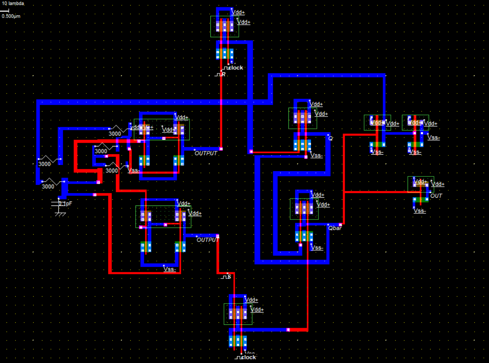

# 📌 CMOS Astable Multivibrator  

This project implements a **CMOS Astable Multivibrator**, a free-running oscillator circuit that continuously generates a square wave without requiring any external trigger.  

The design is implemented using **Microwind** for transistor-level CMOS layout and **NGSpice** for simulation to verify the oscillation waveform.  

---

## 📂 Repository Structure  
CMOS-Astable-Multivibrator/
│── Schematics/ → NGSpice simulation files (.cir, .sp)
│── Layout/ → Microwind CMOS layout files (.mw)
│── Results/ → Simulation waveforms & timing analysis (.png)
│── Docs/ → Project report & documentation (.pdf, .md)

yaml
Copy code

---

## 📷 Design Media  

### 🔹 Layout View (Basic Astable Multivibrator)  
- Designed in **Microwind**  
- CMOS inverter pairs with RC feedback network  
- Generates oscillations at the output node  

  

---

### 🔹 Layout View (Extended Circuit with Q and Q̅)  
- Includes **OUTPUT** and **Qbar** (complementary outputs)  
- Uses resistors and capacitors for timing control  
- Integrated **clock/reset inputs** visible in the layout  
- Metal layers (Blue, Red) used for routing **Vdd, Vss, feedback, and control signals**  

---

### 🔹 Simulation (NGSpice)  
- Output waveform shows **continuous oscillation** between logic HIGH and LOW  
- Extended design also provides **Q/Q̅ complementary outputs**  

---

## ⚡ Working Principle  

The astable multivibrator consists of **two CMOS inverters** connected in a regenerative feedback loop using **resistors and capacitors**.  

1. Capacitor charging/discharging alternately flips the output.  
2. Oscillations continue indefinitely without an external clock.  
3. In the extended design, complementary outputs (Q and Q̅) are also obtained, useful for sequential logic.  

### 📐 Frequency of oscillation  

\[
f \approx \frac{1}{2 \cdot R \cdot C \cdot \ln(2)}
\]

- \(R\) → Resistor value in feedback loop  
- \(C\) → Capacitor value in feedback loop  

---

## 🛠 Tools Used  
- **Microwind** → CMOS layout design & verification  
- **NGSpice** → Circuit-level transient simulation  
- **GitHub** → Version control & project hosting  

---

📌 Applications
Clock signal generation

Pulse generation for digital circuits

Timing circuits in embedded systems

Oscillators in communication systems

Sequential logic with complementary outputs

📖 References
CMOS VLSI Design by Neil Weste & David Harris

NGSpice Documentation: http://ngspice.sourceforge.net

Microwind Official Website: http://www.microwind.org

DUNNA MANIKANTA 
bt22ece104@iiitn.ac.in

